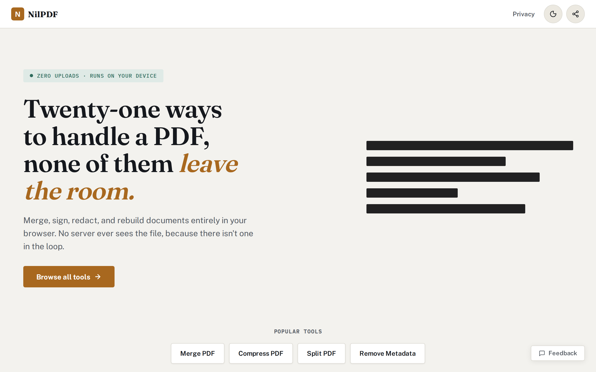
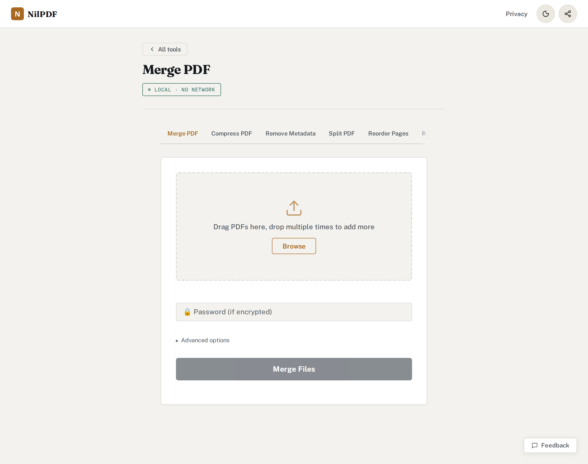

# NilPDF

A free, privacy-first PDF toolkit that runs entirely in your browser — no uploads, no servers, no accounts.

[](https://github.com/kdigitalsystems/nilpdf/actions/workflows/static.yml)
[](LICENSE)
[](https://nilpdf.com)

---

## What is NilPDF?

NilPDF is a collection of PDF tools that process files locally inside your browser using Python compiled to WebAssembly via [Pyodide](https://pyodide.org). Your files never leave your device — there is no backend and no cloud storage, so nothing exists that could receive them. The site does use Google Analytics to count page visits; analytics never has access to your files.

The first visit downloads the Python runtime and packages, about 11 MB, and is usable in roughly three seconds on a fast connection (longer on a slow one, since it is download-bound). Subsequent visits skip that download and start from a local cache.

---

## Screenshots



Every tool is a workspace on the same page. The badge is literal: once the
runtime is cached the tools do not touch the network at all.



---

## Tools

| Tool | Description |
|------|-------------|
| **Merge** | Combine multiple PDFs into one, in any order |
| **Compress** | Reduce file size by compressing content streams and re-encoding images |
| **Scrub** | Strip all metadata (author, timestamps, producer) for privacy |
| **Split** | Extract specific pages, or split into multiple files by range |
| **Reorder** | Drag and drop pages into a new order |
| **Rotate** | Rotate all or selected pages by 90°, 180°, or 270° |
| **Remove Pages** | Delete unwanted pages from a PDF |
| **To Text** | Extract all text content as a plain `.txt` file |
| **To Images** | Convert PDF pages to images |
| **From Images** | Combine images into a single PDF |
| **Watermark** | Overlay diagonal text on every page with adjustable opacity |
| **Page Numbers** | Stamp page numbers in any of six positions |
| **Repair** | Recover pages from corrupted or truncated PDFs |
| **Inspect** | View metadata and page information |
| **Redact** | Black out sensitive areas and add text notes to a PDF |
| **Check Redaction** | Find text still hiding under black boxes, unapplied redactions, or earlier saved versions of a "redacted" PDF |

All tools support password-protected PDFs.

### Command line and Python package

The redaction checker also ships as a pip package, `nilpdf`, for scripts, CI
and pre-commit. It runs locally and makes no network requests:

```bash
pip install nilpdf
nilpdf check-redaction filing.pdf      # exit 0 clean, 1 hidden text, 2 couldn't check
nilpdf check-redaction published/      # every PDF under a directory
```

It's also a pre-commit hook (`id: check-redaction`) and a Python API
(`nilpdf.check_redaction(path_or_bytes)`). See [`python/README.md`](python/README.md).
The package ships `core/pdf_engine.py` itself as `nilpdf.engine`, so the browser
and the CLI always run the same engine; `tests/test_package.py` builds the
wheel and checks they're byte-identical.

---

## How to Use

Visit **[nilpdf.com](https://nilpdf.com)** — no installation required.

- Drop a file onto any tool tab, adjust options, and download the result.
- **Offline support:** after your first visit the app works without an internet connection.
- **Install as an app:** use your browser's "Add to Home Screen" or "Install" option to get a desktop/mobile app experience (PWA).

---

## Privacy

Every operation runs inside a [Web Worker](https://developer.mozilla.org/en-US/docs/Web/API/Web_Workers_API) in your browser. Files are read from your disk into local memory, processed by Python (compiled to WASM), and written back to your disk. No file data is sent anywhere.

---

## For Developers

### Tech stack

| Layer | Technology |
|-------|-----------|
| PDF engine | Python — `pypdf`, `Pillow`, `reportlab`, `cryptography` |
| WASM runtime | [Pyodide v314.0.7](https://pyodide.org) (Python 3.14) |
| Frontend | Vanilla JavaScript (`assets/js/app.js`), HTML/CSS — no build step |
| PDF rendering | [pdf.js](https://mozilla.github.io/pdf.js/) |
| Drag-and-drop reorder | [Sortable.js](https://sortablejs.github.io/Sortable/) |
| ZIP creation | [jszip](https://stuk.github.io/jszip/) |
| Client-side PDF ops | [pdf-lib](https://pdf-lib.js.org/) |
| Package cache | [OPFS](https://developer.mozilla.org/en-US/docs/Web/API/File_System_API/Origin_private_file_system) (first visit downloads ~11 MB, then <1 s from cache) |
| Deployment | GitHub Pages via GitHub Actions |

### Project structure

```
nilpdf/
├── core/
│   └── pdf_engine.py          # All PDF processing logic (21 functions)
├── tests/
│   ├── test_engine.py         # Unit tests for the PDF engine
│   ├── test_site_consistency.py   # Tool registration, dependency pins, sitemap
│   ├── test_js_syntax.py          # node --check over the JS
│   ├── test_no_client_secrets.py  # No credential may ship to the browser
│   └── test_no_banned_punctuation.py
├── assets/
│   ├── css/main.css
│   ├── js/app.js              # The SPA (build version + feedback endpoint stamped by CI)
│   ├── js/pdf_worker.js       # Web Worker: boots Pyodide, dispatches actions
│   ├── icon.svg
│   └── og-image.png
├── feedback-worker/           # Cloudflare Worker: relays the feedback form to GitHub
├── <tool-name>/               # SEO landing pages, one directory per tool
│   └── index.html
├── index.html                 # Page markup and <script> tags (no application logic)
├── sw.js                      # Service worker (caching + COOP/COEP headers; cache name stamped by CI)
├── manifest.json              # PWA manifest
├── requirements.txt           # Dependency pins for the native CI test job
├── dev_server.py              # Local dev server with the COOP/COEP headers Pyodide needs
├── generate_pages.py          # Dev utility: regenerate SEO landing pages
├── pack_repo.py               # Dev utility: bundle repo into a single text file
└── .github/workflows/
    └── static.yml             # CI: test → verify SEO pages in sync → deploy to GitHub Pages
```

`index.html` holds markup only; all application JavaScript lives in
`assets/js/app.js`. It is loaded as a classic (non-module) script from the same
position in the body it used to occupy inline, so top-level declarations are
still globals and the inline `onclick=` handlers in the markup work unchanged.

### Local development

Pyodide requires [`SharedArrayBuffer`](https://developer.mozilla.org/en-US/docs/Web/JavaScript/Reference/Global_Objects/SharedArrayBuffer), which is only available when the page is [cross-origin isolated](https://web.dev/cross-origin-isolation-guide/). A plain `python -m http.server` will not work because it does not set the required headers.

Use the bundled dev server, which sets those headers:

```bash
python3 dev_server.py
```

Then open `http://localhost:8123`.

It sends the same `Cross-Origin-Embedder-Policy: credentialless` that `sw.js`
sets on real traffic. Serving locally under the stricter `require-corp` is
worth avoiding: a cross-origin resource can then load in production but be
blocked on localhost, which is the opposite of what a dev environment should
tell you.

> **Note:** the in-app feedback form is inactive locally. It posts to the
> Cloudflare Worker URL that CI stamps in at deploy time, so an unstamped build
> shows an "unavailable" message rather than attempting the request.

> **Note:** On the first load, Pyodide downloads and installs Python packages (~10 MB). This is cached in OPFS for all subsequent visits.

### Running the tests

Unit tests run the Python engine directly, with no browser:

```bash
pip install -r requirements.txt
pytest tests/ --ignore=tests/e2e
```

Browser tests run the stamped site in Chromium against the real Pyodide runtime:
every worker action, the package cache on a second visit, the engine's whole
unit suite inside Pyodide, and the UI (redaction checker, feedback, offline
mode, the analytics payload). They need Playwright and network access to the
CDNs. The simplest way to match CI exactly is its container:

```bash
docker run --rm --network host -v "$PWD":/repo:ro -w /repo -e PIP_BREAK_SYSTEM_PACKAGES=1 -e NILPDF_E2E=1 \
  mcr.microsoft.com/playwright/python:v1.63.0-noble \
  bash -c "pip install -q -r requirements-e2e.txt && python -m pytest -p no:cacheprovider tests/e2e -v"
```

Lint: `ruff check .` (configured in `pyproject.toml`).

### Adding a new tool

1. **Engine** — add `process_<name>(js_buf, status_id, password)` to [`core/pdf_engine.py`](core/pdf_engine.py). Follow the same signature pattern; use `_ensure_py()`, `_open_reader()`, and `_post_progress()` from the helpers already in that file.

2. **Tests** — add a test class to [`tests/test_engine.py`](tests/test_engine.py). Cover: valid output, producer stamp (or its absence for anonymize), password handling, and error cases.

3. **Worker** — add a new `else if (action === 'ACTION_NAME')` branch in the message handler in [`assets/js/pdf_worker.js`](assets/js/pdf_worker.js), calling the Python function via `pyodide.globals.get('process_<name>')`.

4. **UI** — add the tab, card and drop-zone markup to [`index.html`](index.html), and the handler plus a `TOOL_META` entry to [`assets/js/app.js`](assets/js/app.js). Post a message to the worker with the new action name.

5. **SEO page** (optional) — add tool metadata to [`generate_pages.py`](generate_pages.py) and re-run it to generate a landing page.

A tool has to be registered in several places at once (`TOOL_META`, the tab bar,
the homepage card grid, the footer links, the generator, the sitemap), and
missing one is easy to do and hard to spot by hand. `tests/test_site_consistency.py`
checks all of them against each other, so run the suite rather than clicking
through the UI to confirm a new tool is wired up.

### CI / CD

Everything runs on our **self-hosted runners**, inside containers, and only on
runners labelled `docker`. `tests/test_ci_config.py` enforces that, along with
the other rules below.

**[`static.yml`](.github/workflows/static.yml)**, on every push and pull request:

| Job | What it catches |
|---|---|
| **Lint** | `ruff` (undefined names, unused imports) and `actionlint` (workflow syntax), with actionlint's download checksum-verified |
| **Tests (Python 3.14)** | The unit suite on the browser's Python, with a coverage floor on the engine (`fail_under` in `pyproject.toml`), plus the SEO pages being out of sync with `generate_pages.py` |
| **Tests (Python 3.10, 3.12)** | The rest of the range the pip package supports |
| **Browser tests** | What unit tests can't see: the worker failing to boot, a broken offline mode, UI state, the deploy stamping, and the engine on the real WebAssembly libraries |
| **Deploy** | `main` only, and only after **every** job above passes. Stamps the build with [`scripts/stamp_build.py`](scripts/stamp_build.py), then publishes to GitHub Pages |

Pull requests from outside contributors need approval before any of this runs,
because it runs on our hardware. Jobs that run pull-request code are
read-only; only the deploy and publish jobs get elevated permissions. Actions
are pinned to commit SHAs, which Dependabot keeps current.

**The deploy job stamps no credentials.** Everything it writes into the site is
served to browsers and is therefore public, so it only injects public values:
the build version, the cache name, and the feedback Worker's URL. The GitHub
token used by feedback lives in the Cloudflare Worker
([`feedback-worker/`](feedback-worker/index.js)). `tests/test_no_client_secrets.py`
fails the build if a credential reappears in the deploy path.

**Repository configuration:** set `FEEDBACK_ENDPOINT` (Settings → Secrets and
variables → Actions → **Variables**) to the deployed Worker URL. Until it's set,
feedback opens a pre-filled GitHub issue instead.

### Releasing the pip package

[`release.yml`](.github/workflows/release.yml) publishes `nilpdf` to PyPI when a
version tag is pushed:

1. Bump `__version__` in `python/nilpdf/__init__.py` and the `rev:` in
   `python/README.md` (a test checks they match), and merge to `main`.
2. Tag the merge commit and push the tag:
   `git tag -a v0.2.0 -m "nilpdf 0.2.0" && git push origin v0.2.0`

The workflow refuses to publish unless the tag matches `__version__` and is on
`main`. It runs the unit tests at that commit, builds the sdist and wheel,
checks them with `twine check --strict`, installs the exact wheel in a clean
environment and runs it, and only then uploads, using PyPI **trusted publishing**:
no token is stored anywhere.

To dry-run a release, or to publish a tag that already exists, run the workflow
by hand from `main` (Actions → Release to PyPI → Run workflow), giving the tag.
Leave *publish* unticked for a dry run.

**One-time PyPI setup.** On pypi.org, under *Publishing*, add a trusted
publisher: owner `kdigitalsystems`, repository `nilpdf`, workflow
`release.yml`, environment `pypi`.

### Search engines

- **Bing, DuckDuckGo, Ecosia, Copilot, ChatGPT search, Yandex** — after a deploy that changes pages, run `python3 submit_indexnow.py`. It submits every URL in `sitemap.xml` through [IndexNow](https://www.indexnow.org/). Ownership is proven by the `<32 hex>.txt` key file at the repo root, which must stay deployed.
- **Google** doesn't take part in IndexNow and needs [Search Console](https://search.google.com/search-console): add `nilpdf.com` as a Domain property, verify it with the DNS TXT record Google gives you, then submit `https://nilpdf.com/sitemap.xml` under *Sitemaps*.
- `sitemap.xml` is maintained by hand. Update a page's `<lastmod>` when its content changes, since that's the signal crawlers use to decide what to re-fetch.

---

## Contributing

Issues and pull requests are welcome.

- Keep all PDF processing in pure Python inside `core/pdf_engine.py` — it must run inside Pyodide with no native extensions.
- Run `pytest tests/` before opening a PR.
- If you change `generate_pages.py` or any tool metadata it reads, re-run it and commit the regenerated landing pages — CI fails the build if they're out of sync.
- Never put a credential in `index.html`, `assets/js/`, or `sw.js`. Those files are downloaded verbatim by every visitor. Anything needing a secret belongs in `feedback-worker/`.
- Bumping `pypdf` or `reportlab` means editing two files: `requirements.txt` and the `micropip.install()` pins in `assets/js/pdf_worker.js`. CI fails while they disagree, because otherwise the tests would be validating versions no user runs.
- Adding a third-party `<script>` tag requires an `integrity=` hash alongside it.
- The CI pipeline will run tests automatically on every push.

---

## License

[MIT](LICENSE)
