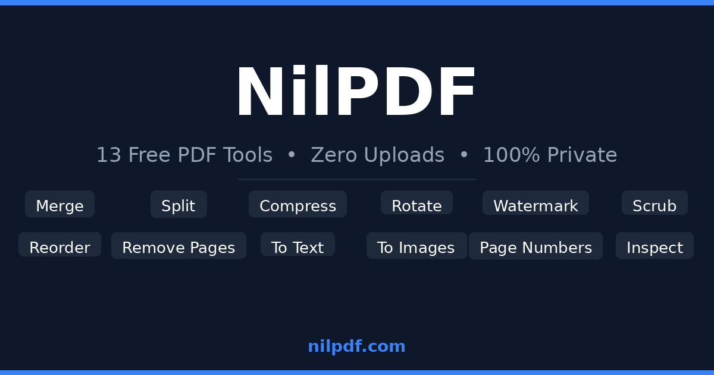

# NilPDF

A free, privacy-first PDF toolkit that runs entirely in your browser — no uploads, no servers, no accounts.

[](https://github.com/kdigitalsystems/nilpdf/actions/workflows/static.yml)
[](LICENSE)
[](https://nilpdf.com)

---

## What is NilPDF?

NilPDF is a collection of PDF tools that process files locally inside your browser using Python compiled to WebAssembly via [Pyodide](https://pyodide.org). Your files never leave your device — there is no backend, no cloud storage, and no tracking.

The first visit installs the Python runtime (~10 MB); subsequent visits load in under a second from a local cache.

---

## Screenshots

<!-- Add a screenshot or GIF here -->


---

## Tools

| Tool | Description |
|------|-------------|
| **Merge** | Combine multiple PDFs into one, in any order |
| **Compress** | Reduce file size by compressing content streams and re-encoding images |
| **Scrub** | Strip all metadata (author, timestamps, producer) for privacy |
| **Split** | Extract specific pages, or split into multiple files by range |
| **Reorder** | Drag and drop pages into a new order |
| **Rotate** | Rotate all or selected pages by 90°, 180°, or 270° |
| **Remove Pages** | Delete unwanted pages from a PDF |
| **To Text** | Extract all text content as a plain `.txt` file |
| **To Images** | Convert PDF pages to images |
| **From Images** | Combine images into a single PDF |
| **Watermark** | Overlay diagonal text on every page with adjustable opacity |
| **Page Numbers** | Stamp page numbers in any of six positions |
| **Repair** | Recover pages from corrupted or truncated PDFs |
| **Inspect** | View metadata and page information |

All tools support password-protected PDFs.

---

## How to Use

Visit **[nilpdf.com](https://nilpdf.com)** — no installation required.

- Drop a file onto any tool tab, adjust options, and download the result.
- **Offline support:** after your first visit the app works without an internet connection.
- **Install as an app:** use your browser's "Add to Home Screen" or "Install" option to get a desktop/mobile app experience (PWA).

---

## Privacy

Every operation runs inside a [Web Worker](https://developer.mozilla.org/en-US/docs/Web/API/Web_Workers_API) in your browser. Files are read from your disk into local memory, processed by Python (compiled to WASM), and written back to your disk. No data is sent anywhere.

---

## For Developers

### Tech stack

| Layer | Technology |
|-------|-----------|
| PDF engine | Python — `pypdf`, `Pillow`, `reportlab`, `cryptography` |
| WASM runtime | [Pyodide v0.25.0](https://pyodide.org) |
| Frontend | Vanilla JavaScript, HTML/CSS |
| PDF rendering | [pdf.js](https://mozilla.github.io/pdf.js/) |
| Drag-and-drop reorder | [Sortable.js](https://sortablejs.github.io/Sortable/) |
| ZIP creation | [jszip](https://stuk.github.io/jszip/) |
| Client-side PDF ops | [pdf-lib](https://pdf-lib.js.org/) |
| Package cache | [OPFS](https://developer.mozilla.org/en-US/docs/Web/API/File_System_API/Origin_private_file_system) (first visit ~30 s → repeat <1 s) |
| Deployment | GitHub Pages via GitHub Actions |

### Project structure

```
nilpdf/
├── core/
│   └── pdf_engine.py          # All PDF processing logic (18 functions)
├── tests/
│   └── test_engine.py         # Unit tests (14 test classes)
├── assets/
│   ├── css/main.css
│   ├── js/pdf_worker.js       # Web Worker: boots Pyodide, dispatches actions
│   ├── icon.svg
│   └── og-image.png
├── <tool-name>/               # SEO landing pages, one directory per tool
│   └── index.html
├── index.html                 # Main SPA
├── sw.js                      # Service worker (caching + COOP/COEP headers)
├── manifest.json              # PWA manifest
├── version.js                 # Build version (stamped by CI)
├── generate_pages.py          # Dev utility: regenerate SEO landing pages
├── pack_repo.py               # Dev utility: bundle repo into a single text file
└── .github/workflows/
    └── static.yml             # CI: test → deploy to GitHub Pages
```

### Local development

Pyodide requires [`SharedArrayBuffer`](https://developer.mozilla.org/en-US/docs/Web/JavaScript/Reference/Global_Objects/SharedArrayBuffer), which is only available when the page is [cross-origin isolated](https://web.dev/cross-origin-isolation-guide/). A plain `python -m http.server` will not work because it does not set the required headers.

**Option A — Python dev server with correct headers**

```python
# serve.py — run with: python serve.py
from http.server import HTTPServer, SimpleHTTPRequestHandler

class COEPHandler(SimpleHTTPRequestHandler):
    def end_headers(self):
        self.send_header("Cross-Origin-Opener-Policy", "same-origin")
        self.send_header("Cross-Origin-Embedder-Policy", "require-corp")
        super().end_headers()

HTTPServer(("localhost", 8080), COEPHandler).serve_forever()
```

**Option B — `npx serve` with a config file**

```json
// serve.json
{
  "headers": [
    {
      "source": "**",
      "headers": [
        { "key": "Cross-Origin-Opener-Policy", "value": "same-origin" },
        { "key": "Cross-Origin-Embedder-Policy", "value": "require-corp" }
      ]
    }
  ]
}
```

```bash
npx serve -l 8080
```

Then open `http://localhost:8080`.

> **Note:** On the first load, Pyodide downloads and installs Python packages (~10 MB). This is cached in OPFS for all subsequent visits.

### Running the tests

The test suite runs the Python engine directly — no browser required.

```bash
pip install pypdf cryptography Pillow reportlab pytest
pytest tests/ -v --tb=short
```

### Adding a new tool

1. **Engine** — add `process_<name>(js_buf, status_id, password)` to [`core/pdf_engine.py`](core/pdf_engine.py). Follow the same signature pattern; use `_ensure_py()`, `_open_reader()`, and `_post_progress()` from the helpers already in that file.

2. **Tests** — add a test class to [`tests/test_engine.py`](tests/test_engine.py). Cover: valid output, producer stamp (or its absence for anonymize), password handling, and error cases.

3. **Worker** — add a new `case 'ACTION_NAME':` block in the message handler in [`assets/js/pdf_worker.js`](assets/js/pdf_worker.js), calling the Python function via `pyodide.globals.get('process_<name>')`.

4. **UI** — add a tab and drop zone in [`index.html`](index.html). Post a message to the worker with the new action name.

5. **SEO page** (optional) — add tool metadata to [`generate_pages.py`](generate_pages.py) and re-run it to generate a landing page.

### CI / CD

The GitHub Actions workflow ([`.github/workflows/static.yml`](.github/workflows/static.yml)) runs on every push:

1. **Test job** — installs dependencies, runs `pytest tests/ -v --tb=short`.
2. **Deploy job** (main branch only, after tests pass) — stamps `version.js` with the commit SHA and date, then uploads to GitHub Pages.

---

## Contributing

Issues and pull requests are welcome.

- Keep all PDF processing in pure Python inside `core/pdf_engine.py` — it must run inside Pyodide with no native extensions.
- Run `pytest tests/` before opening a PR.
- The CI pipeline will run tests automatically on every push.

---

## License

[MIT](LICENSE)
